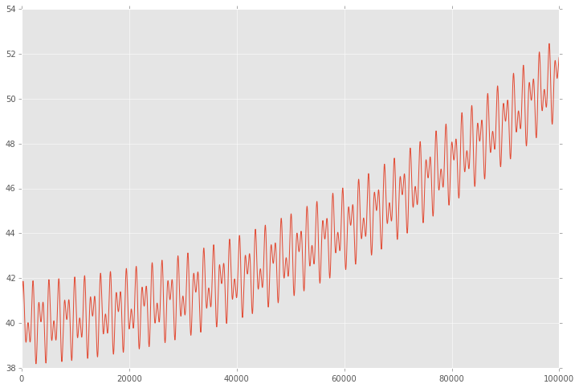
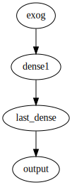
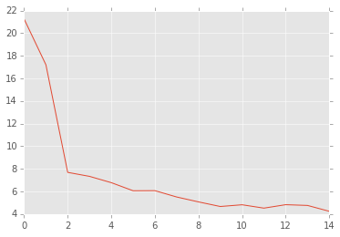
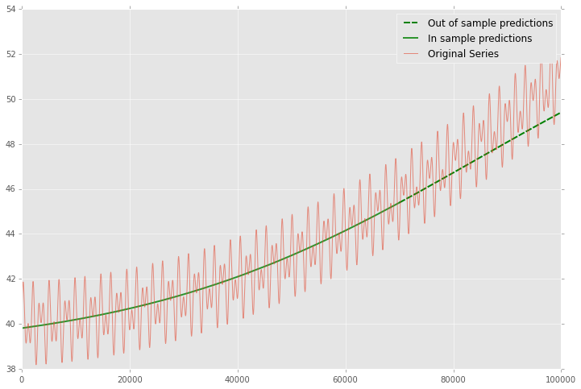
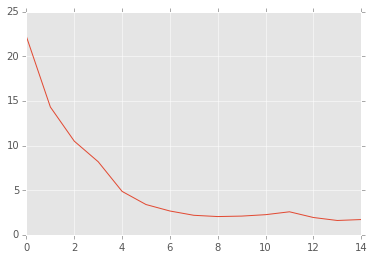
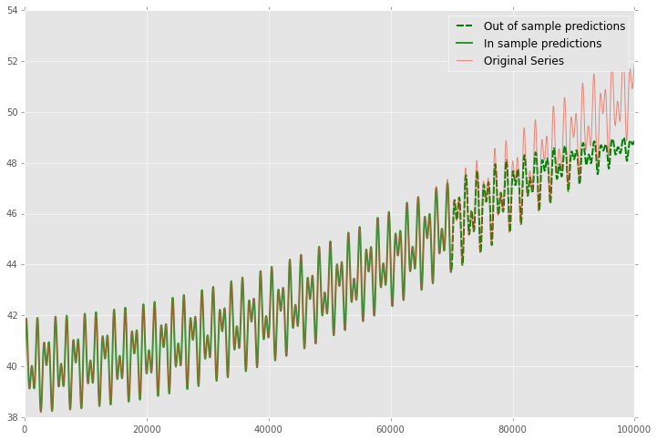

Neural Nets with Keras - Part 1 : Time series
#############################################

:date: 2015-11-24 11:22
:category: Tutorials 
:tags: python, keras 
:summary: Simple neural nets with keras 

Introduction and data generation
--------------------------------

This first part of the tutorial will focus on simple Artificial Neural
Networks.

We will try to predict time series (continuous signals) using simple
architectures.

The notation used are taken from the `best introduction`_ to neural networks I've found from Hugo Larochelle.

Suppose that we want to study a time series following this process:

.. math:: y_t = \sin(\pi\frac{x_t}{800})

We can easily generate this data with numpy:

.. code:: python

    import numpy as np
    np.random.seed(1337)
    
    
    sample = 100000
    Fs = 80
    f = 5
    time = np.arange(sample)
    
    y_t = 40 + np.sin((2 * np.pi * f * time)/ Fs/100) +1e-5*time+1e-9*time**2 + np.sin((np.pi * f/2 * time) / Fs / 15)

Graphically we have a nice sinusoidal function:

.. code:: python

    import matplotlib.pyplot as plt
    %matplotlib inline
    fig = plt.figure(figsize=(12,8))
    plt.style.use('ggplot')
    plt.plot(y_t[:])
    plt.show()

Observations :

1. it's a nonlinear process
2. it's not stationary because we see big cycles and seasonnality
3. it's strictly positive

Let's try a simple neural net with a single hidden layer on this data.

let :math:`y_t` be the value of the signal at time
:math:`t=1,\dots, 100000`

We define:

-  the hidden layers pre-activation:

.. math:: a(t)_i = b_i^{(1)} + W_i^{(1)}t

-  the hidden layers activation:

.. math:: h(t)_i = g(a(t)_i)

-  the output layer activation:

.. math:: f(t) = o(b^{(2)} + w_i^{(2)}h^{(1)}(t)_i)

Where we want :math:`f(t)` as close as possible to :math:`y_t`

Here we will build a hidden layer with 10 units the hidden layer
activation function :math:`g()` is a sigmoid and the output layer
activation function is linear.

.. code:: python

    import theano
    import keras
    from keras.models import Graph
    from keras.layers.core import Dense
    from keras.optimizers import Adam
    
    
    model = Graph()
    model.add_input(name='exog', input_shape=(1,))
    model.add_node(Dense(10, activation="sigmoid"), name='dense1', input='exog')
    model.add_node(Dense(1, activation="linear"), name='last_dense', input='dense1')
    model.add_output(name='output', input='last_dense')
    adam = Adam(lr=1e-2, beta_1=0.9, beta_2=0.999, epsilon=1e-8)
    
    model.compile(optimizer=adam, loss={'output':'mse'})

.. code:: python

    from IPython.display import SVG
    from keras.utils.visualize_util import to_graph
    
    SVG(to_graph(model).create(prog='dot', format='svg'))

.. code:: python

    print([np.prod(p.shape.eval()) for p in model.params])
    print(model.count_params())

.. parsed-literal::

    <CudaNdarrayType(float32, matrix)>
    [10, 10, 10, 1]
    31

.. code:: python

    time = (time - time.mean())/time.std()
    history = model.fit({'exog': time[:-30000,None], 'output': y_t[:-30000]},
              validation_data={'exog':time[-30000:, None], 'output': y_t[-30000:]},
              batch_size=32,
              nb_epoch=15)

.. parsed-literal::

    Train on 70000 samples, validate on 30000 samples
    Epoch 1/15
    70000/70000 [==============================] - 2s - loss: 135.5583 - val_loss: 21.2578
    Epoch 2/15
    70000/70000 [==============================] - 2s - loss: 1.5000 - val_loss: 17.2053
    Epoch 3/15
    70000/70000 [==============================] - 2s - loss: 1.0667 - val_loss: 7.6860
    Epoch 4/15
    70000/70000 [==============================] - 2s - loss: 1.0218 - val_loss: 7.3328
    Epoch 5/15
    70000/70000 [==============================] - 2s - loss: 1.0213 - val_loss: 6.7753
    Epoch 6/15
    70000/70000 [==============================] - 2s - loss: 1.0226 - val_loss: 6.0602
    Epoch 7/15
    70000/70000 [==============================] - 2s - loss: 1.0212 - val_loss: 6.0677
    Epoch 8/15
    70000/70000 [==============================] - 2s - loss: 1.0214 - val_loss: 5.5073
    Epoch 9/15
    70000/70000 [==============================] - 2s - loss: 1.0194 - val_loss: 5.0734
    Epoch 10/15
    70000/70000 [==============================] - 3s - loss: 1.0211 - val_loss: 4.6668
    Epoch 11/15
    70000/70000 [==============================] - 2s - loss: 1.0185 - val_loss: 4.8204
    Epoch 12/15
    70000/70000 [==============================] - 2s - loss: 1.0183 - val_loss: 4.5225
    Epoch 13/15
    70000/70000 [==============================] - 2s - loss: 1.0195 - val_loss: 4.8269
    Epoch 14/15
    70000/70000 [==============================] - 2s - loss: 1.0196 - val_loss: 4.7607
    Epoch 15/15
    70000/70000 [==============================] - 2s - loss: 1.0196 - val_loss: 4.2425

.. code:: python

    plt.plot(history.history["val_loss"])
    plt.show()

.. code:: python

    predictions_oos = model.predict({'exog': time[-30000:,None]}, batch_size=128)
    predictions_is = model.predict({'exog': time[:-30000,None]}, batch_size=128)
    predictionsg_oos = np.concatenate([np.array([np.nan for el in range(70000)]), predictions_oos["output"].flatten()])
    predictionsg_is = np.concatenate([predictions_is["output"].flatten(), np.array([np.nan for el in range(30000)])])
    
    fig = plt.figure(figsize=(12,8))
    print(np.sqrt((predictions_oos["output"].flatten()-y_t[-30000:])**2).mean())
    plt.plot(predictionsg_oos, color="green", dashes=[8,2], linewidth=2, label="Out of sample predictions")
    plt.plot(predictionsg_is, color="green", alpha=0.8, linewidth=2, label="In sample predictions")
    plt.plot(y_t, alpha=0.6, label="Original Series")
    plt.legend()
    plt.show()

.. parsed-literal::

    1.06712052617

We can fit the trend in the training set but the validation performance
is not crazy. Let's add some regularization on the parameters of the
last layer. We choose a L1 regularization to have a sparse structure in
the model. TODO REF

.. code:: python

    from keras.regularizers import l1l2, l1
    
    model = Graph()
    model.add_input(name='exog', input_shape=(1,))
    model.add_node(Dense(10, activation="sigmoid", W_regularizer=l1(0.1)), name='dense1', input='exog')
    model.add_node(Dense(1, activation="linear"), name='last_dense', input='dense1')
    model.add_output(name='output', input='last_dense')
    adam = Adam(lr=1e-2, beta_1=0.9, beta_2=0.999, epsilon=1e-8)
    
    model.compile(optimizer=adam, loss={'output':'mse'})

.. code:: python

    history = model.fit({'exog': time[:-30000,None], 'output': y_t[:-30000]},
              validation_data={'exog':time[-30000:, None], 'output': y_t[-30000:]},
              batch_size=32,
              nb_epoch=15)

.. parsed-literal::

    Train on 70000 samples, validate on 30000 samples
    Epoch 1/15
    70000/70000 [==============================] - 3s - loss: 136.6215 - val_loss: 22.1850
    Epoch 2/15
    70000/70000 [==============================] - 3s - loss: 1.5800 - val_loss: 14.3134
    Epoch 3/15
    70000/70000 [==============================] - 3s - loss: 1.3127 - val_loss: 10.4879
    Epoch 4/15
    70000/70000 [==============================] - 3s - loss: 1.2291 - val_loss: 8.1836
    Epoch 5/15
    70000/70000 [==============================] - 3s - loss: 1.1846 - val_loss: 4.8606
    Epoch 6/15
    70000/70000 [==============================] - 3s - loss: 1.1621 - val_loss: 3.3897
    Epoch 7/15
    70000/70000 [==============================] - 3s - loss: 1.1507 - val_loss: 2.6652
    Epoch 8/15
    70000/70000 [==============================] - 3s - loss: 1.1454 - val_loss: 2.1846
    Epoch 9/15
    70000/70000 [==============================] - 3s - loss: 1.1367 - val_loss: 2.0425
    Epoch 10/15
    70000/70000 [==============================] - 3s - loss: 1.1325 - val_loss: 2.0950
    Epoch 11/15
    70000/70000 [==============================] - 3s - loss: 1.1299 - val_loss: 2.2542
    Epoch 12/15
    70000/70000 [==============================] - 3s - loss: 1.1272 - val_loss: 2.5774
    Epoch 13/15
    70000/70000 [==============================] - 3s - loss: 1.1257 - val_loss: 1.9371
    Epoch 14/15
    70000/70000 [==============================] - 3s - loss: 1.1252 - val_loss: 1.6037
    Epoch 15/15
    70000/70000 [==============================] - 3s - loss: 1.1203 - val_loss: 1.7094

.. code:: python

    plt.plot(history.history["val_loss"])
    plt.show()

.. code:: python

    predictions_oos = model.predict({'exog': time[-30000:,None]}, batch_size=128)
    predictions_is = model.predict({'exog': time[:-30000,None]}, batch_size=128)
    predictionsg_oos = np.concatenate([np.array([np.nan for el in range(70000)]), predictions_oos["output"].flatten()])
    predictionsg_is = np.concatenate([predictions_is["output"].flatten(), np.array([np.nan for el in range(30000)])])
    
    fig = plt.figure(figsize=(12,8))
    print(np.sqrt((predictions_oos["output"].flatten()-y_t[-30000:])**2).mean())
    plt.plot(predictionsg_oos, color="green", dashes=[8,2], linewidth=2, label="Out of sample predictions")
    plt.plot(predictionsg_is, color="green", alpha=0.8, linewidth=2, label="In sample predictions")
    plt.plot(y_t, alpha=0.6, label="Original Series")
    plt.legend()
    plt.show()

.. parsed-literal::

    1.06712052617

It seems reasonnable to add some regularization since we capture the
quadratic trend with more accuracy.

Using an AR structure for one step ahead predictions
====================================================

Because we have seasonnality in our data we could try to use lags of the
time series to capture the recurrent patterns we see.

To do so, we crop some patches out of our time series.

.. code:: python

    from sklearn.feature_extraction.image import extract_patches_2d
    
    len_ts_y = 60
    
    data_patched = extract_patches_2d(y_t[:,None], (len_ts_y,1))
    y_train = data_patched[:,-1,-1]
    endog_train = data_patched[:,-len_ts_y-1:-1,-1]

.. code:: python

    endog_train.shape

.. parsed-literal::

    (99941, 59)

.. code:: python

    endog_train = (endog_train-endog_train.mean(axis=0))/endog_train.std(axis=0)

.. code:: python

    model = Graph()
    model.add_input(name='endog', input_shape=(59,))
    model.add_node(Dense(10, activation="sigmoid"), name='dense1', input='exog')
    model.add_node(Dense(1, activation="linear"), name='last_dense', input='dense1')
    model.add_output(name='output', input='last_dense')
    adam = Adam(lr=1e-3, beta_1=0.9, beta_2=0.999, epsilon=1e-8)
    
    model.compile(optimizer=adam, loss={'output':'mse'})

.. code:: python

    history = model.fit({'endog': endog_train[:-30000].reshape(-1,59), 'output': y_t[:-30000]},
              validation_data={'endog':endog_train[-30000:].reshape(-1,59), 'output': y_t[-30000:]},
              batch_size=32,
              nb_epoch=15)

.. parsed-literal::

    Train on 69941 samples, validate on 30000 samples
    Epoch 1/15
    69941/69941 [==============================] - 3s - loss: 982.9619 - val_loss: 1247.8897
    Epoch 2/15
    69941/69941 [==============================] - 3s - loss: 145.4111 - val_loss: 191.2051
    Epoch 3/15
    69941/69941 [==============================] - 3s - loss: 6.9168 - val_loss: 24.1287
    Epoch 4/15
    69941/69941 [==============================] - 3s - loss: 0.5594 - val_loss: 17.7060
    Epoch 5/15
    69941/69941 [==============================] - 3s - loss: 0.4401 - val_loss: 15.0404
    Epoch 6/15
    69941/69941 [==============================] - 3s - loss: 0.2117 - val_loss: 10.1495
    Epoch 7/15
    69941/69941 [==============================] - 3s - loss: 0.0487 - val_loss: 5.9489
    Epoch 8/15
    69941/69941 [==============================] - 2s - loss: 0.0100 - val_loss: 3.6337
    Epoch 9/15
    69941/69941 [==============================] - 3s - loss: 0.0040 - val_loss: 2.6690
    Epoch 10/15
    69941/69941 [==============================] - 3s - loss: 0.0029 - val_loss: 2.2827
    Epoch 11/15
    69941/69941 [==============================] - 3s - loss: 0.0021 - val_loss: 2.1616
    Epoch 12/15
    69941/69941 [==============================] - 2s - loss: 0.0011 - val_loss: 1.9064
    Epoch 13/15
    69941/69941 [==============================] - 3s - loss: 0.0008 - val_loss: 1.6561
    Epoch 14/15
    69941/69941 [==============================] - 3s - loss: 0.0007 - val_loss: 1.4773
    Epoch 15/15
    69941/69941 [==============================] - 2s - loss: 0.0005 - val_loss: 1.2757

.. code:: python

    predictions_oos = model.predict({'exog': endog_train[-30000:].reshape(-1,59)}, batch_size=128)
    predictions_is = model.predict({'exog': endog_train[:-30000].reshape(-1,59)}, batch_size=128)
    predictionsg_oos = np.concatenate([np.array([np.nan for el in range(70000)]), predictions_oos["output"].flatten()])
    predictionsg_is = np.concatenate([predictions_is["output"].flatten(), np.array([np.nan for el in range(30000)])])
    
    fig = plt.figure(figsize=(12,8))
    print(np.sqrt((predictions_oos["output"].flatten()-y_t[-30000:])**2).mean())
    plt.plot(predictionsg_oos, color="green", dashes=[8,2], linewidth=2, label="Out of sample predictions")
    plt.plot(predictionsg_is, color="green", alpha=0.8, linewidth=2, label="In sample predictions")
    plt.plot(y_t, alpha=0.6, label="Original Series")
    plt.legend()
    plt.show()

.. parsed-literal::

    0.818090224748

.. _`best introduction`: https://www.youtube.com/playlist?list=PL6Xpj9I5qXYEcOhn7TqghAJ6NAPrNmUBH
