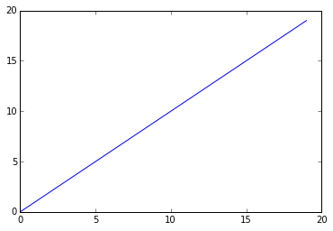

Test
#####

:date: 2015-08-03 10:28
:category: Tutorials 
:tags: python, numpy, scipy 
:summary: Numpy, tips and tricks 

This is a test
==============

:math:`\sum x_i = \beta`

.. code:: python

    import numpy as np
    import matplotlib.pyplot as plt
    %matplotlib inline

.. code:: python

    my_ar = np.array(range(20))
    print(my_ar)

.. parsed-literal::

    [ 0  1  2  3  4  5  6  7  8  9 10 11 12 13 14 15 16 17 18 19]

.. code:: python

    plt.plot(my_ar)
    plt.show()

